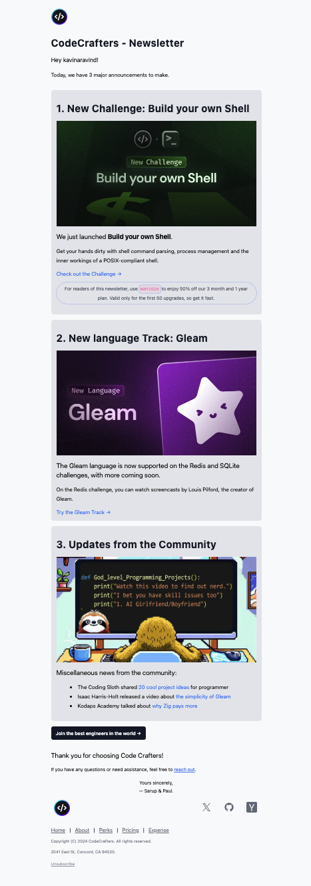

# React Email - CodeCrafters

A sample newsletter template built with React and Tailwind CSS for [CodeCrafters](https://codecrafters.io/).



## Getting Started

First, install the dependencies:

```sh
npm install
```

Then, run the development server:

```sh
npm run dev
```

Open [localhost:3000](http://localhost:3000) with your browser to see the template.

## Building The Static HTML Templates

To build the static html templates for production, run:

```sh
npm run export
```

This will generate the static html files in the `out` directory which can be used to send emails with your email service provider.

You may have to work through the templating system of your email service provider to get the templates to function correctly.

## License

MIT License
